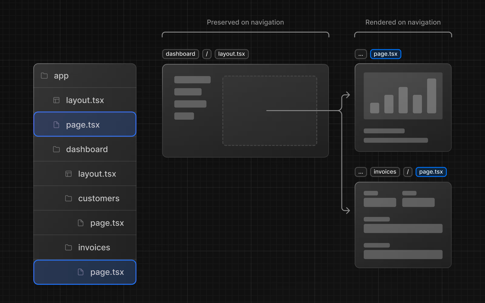

# Take note
## Chapter 1
/app: contain all the routes, logics for application
/app/lib: contains functions used in application, such as reusable utility functions and data fetching functions.
/app/ui: contains all UI components for application

## Chapter 2
- CSS: Provide a way to make CSS classes locally scoped to components by default, reducing the risk of styling conflicts.
- Using Tailwindcss
- clsx: https://github.com/lukeed/clsx
*Cannot Find Module for Global CSS Imports*: https://github.com/vercel/next.js/discussions/88268

## Chapter 4
// TODO
https://nextjs.org/docs/app/getting-started/linking-and-navigating#4-partial-rendering

/app/layout.tsx => is a root layout
This is required in every Next.js application. Any UI you add to the root layout will be shared across all pages in your application